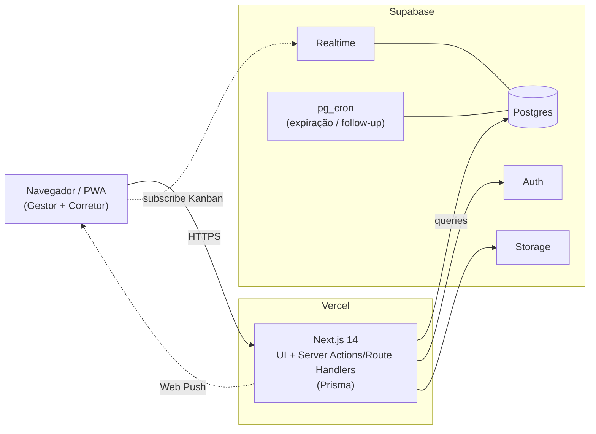

# ImobCRM — Blueprint de Execução (v2)

> **Stack: Solo dev · Supabase · Next.js (PWA).** Esta versão substitui a v1.
> Documento de partida para começar a desenvolver. O documento técnico completo
> continua valendo como referência de domínio; aqui é o caminho real de execução.

---

## 1. O que mudou da v1 (e por quê)

Você está **sozinho** e escolheu **Supabase + plataforma web/PWA** (sem loja). Isso enxuga a stack de forma agressiva — menos coisa pra montar e manter:

| v1 (original) | v2 (agora) | Motivo |
|---|---|---|
| Flutter (app nativo) | ❌ removido | Web + PWA cobre o uso; sem fila da Apple/Google |
| NestJS (backend separado) | ❌ vira Next.js full-stack | 1 codebase, 1 deploy — ideal solo |
| Auth na mão (JWT + refresh) | ✅ Supabase Auth | Economiza um sprint inteiro |
| Redis + BullMQ (jobs) | ✅ Supabase pg_cron | Jobs agendados sem infra extra |
| AWS S3 (storage) | ✅ Supabase Storage | Já vem junto |
| WebSocket próprio (Kanban) | ✅ Supabase Realtime | Tempo-real sem montar nada |
| FCM (push) | ✅ Web Push (PWA) | Push direto do navegador |

Resultado: você opera **dois serviços gerenciados** (Vercel + Supabase) e **um repositório**. Quase nenhuma infra pra cuidar.

---

## 2. Stack nova

| Camada | Tecnologia |
|---|---|
| App (front + back) | **Next.js 14** (App Router) — Server Actions / Route Handlers |
| PWA | manifest + service worker (`next-pwa`) |
| Banco | **Supabase Postgres** |
| Acesso a dados | **Prisma 5** (server-side) — o `schema.prisma` continua valendo |
| Auth | **Supabase Auth** (e-mail/senha + magic link) |
| Tempo-real | **Supabase Realtime** (Kanban) |
| Storage | **Supabase Storage** (fotos, plantas, docs) |
| Jobs agendados | **Supabase pg_cron** (expiração de reserva, follow-ups) |
| Push | **Web Push** (VAPID) |
| Estilo | Tailwind |
| Hospedagem | **Vercel** (Next.js) + Supabase |

> **Sobre acesso a dados — Prisma × supabase-js.** Recomendo **Prisma** no MVP: você já tem o schema, é type-safe e a curva é suave (escreve quase nenhum SQL). O `supabase-js` com RLS é a alternativa mais "nativa Supabase" — você pode migrar pra ele na Fase 2, quando ligar o RLS de verdade. Não precisa decidir isso agora.

> **Push no iPhone:** Web Push em PWA funciona no iOS **16.4+**, mas só quando o usuário **instala o app na tela inicial** ("Adicionar à Tela de Início"). No desktop e Android funciona normal. Vale avisar os corretores de iPhone a instalarem.

---

## 3. O que o Supabase te dá de graça (e o que você ainda escreve)

**Vem pronto:** login/cadastro/recuperação de senha, banco Postgres gerenciado (backup automático), upload de arquivos com URL pública/assinada, eventos de tempo-real nas tabelas, jobs agendados via SQL, e um painel visual pra ver tudo.

**Você ainda escreve (a lógica de negócio):** distribuição/atribuição de lead, regras do funil, trava e expiração de reserva, fluxo de aprovação de proposta, cálculo dos KPIs, trilha de auditoria. Isso vive nas **Server Actions / Route Handlers** do Next.js.

---

## 4. Fronteira do MVP

A regra continua: **resista a adicionar escopo.** O que muda da v1: Auth fica trivial (Supabase) e multitenancy real (RLS) sai do MVP — roda com **1 tenant fixo**.

| Módulo | ✅ Entra no MVP | ❌ Fica para depois |
|---|---|---|
| Auth | Login/cadastro (Supabase), RBAC por `role` no perfil | MFA, multitenancy real (RLS) |
| Leads | CRUD, lista, filtros, atribuição, timeline | Importação CSV, Facebook, score automático |
| Funil | Funil único, Kanban drag-and-drop + Realtime | Múltiplos funis, forecast, regras de transição |
| Clientes | Cadastro básico, conversão de lead | Documentos, perfil de interesse completo |
| Empreendimentos | CRUD, blocos, unidades, status, preço | Mapa interativo, versionamento de preços |
| Propostas | Criação + aprovação de **1 nível** | Múltiplas alçadas, geração de PDF |
| Reservas | Reserva com expiração automática (pg_cron) | Renovação, cancelamento avançado |
| Notificações | In-app + Web Push básico | E-mail, preferências por canal |
| Dashboard | KPIs básicos (leads, conversão, vendas) | BI completo, exportação |

**MVP pronto:** corretor recebe lead → registra atividades → move no funil → reserva unidade → cria proposta → gestor aprova, **tudo no navegador (PWA)**, refletido no dashboard.

---

## 5. Arquitetura



Um único app no Vercel conversa com os serviços do Supabase. O Realtime escuta mudanças na tabela `leads` (e emite eventos mesmo quando a escrita vem do Prisma) — é o que faz o Kanban atualizar ao vivo.

---

## 6. Repositório (um só)

```
imobcrm/                 → Next.js (UI + API + Prisma)
  app/                   → App Router (rotas, layouts, server actions)
  components/            → design system + features
  lib/                   → supabase client, prisma client, utils
  prisma/                → schema.prisma + migrations
  public/                → manifest.json, ícones PWA
  supabase/              → migrations SQL, functions (pg_cron), seed
```

---

## 7. Modelo de dados

O **`schema.prisma`** (entregue junto, já atualizado pra Supabase) continua sendo a fonte da verdade. Mudanças desta versão:

- A tabela `users` virou **perfil**: sem senha (o Supabase Auth cuida), `id` = id do usuário autenticado.
- `pushSubscription` no lugar do antigo token FCM.
- RLS fica para a Fase 2 — no MVP, `tenant_id` está nas tabelas mas o isolamento é só lógico (1 tenant).

**Auth (perfil no signup):** quando um usuário se cadastra no Supabase Auth, crie a linha correspondente em `users` com o mesmo `id`. O jeito mais robusto é um **trigger SQL** em `auth.users` que insere o perfil automaticamente — assim você nunca tem usuário sem perfil.

`DATABASE_URL` do Prisma deve apontar para o **pooler** do Supabase (porta 6543).

---

## 8. Plano de sprints (mais enxuto que a v1)

| Sprint | Sem. | Entrega | "Pronto" quando… |
|---|---|---|---|
| **0** | 1 | Repo Next.js, projeto Supabase, Prisma migrate, PWA shell, deploy no Vercel | App vazio no ar (Vercel) com banco criado no Supabase |
| **1** | 2–3 | Auth: login/cadastro Supabase, perfil via trigger, RBAC por role, rotas protegidas | Admin loga e cai numa rota protegida; corretor não vê tela de admin |
| **2** | 4–5 | Leads: CRUD, lista, filtros, atribuição, timeline | Corretor cria lead, registra atividade e vê a timeline |
| **3** | 6–7 | Funil Kanban (drag-and-drop) + Supabase Realtime | Mover card atualiza ao vivo em outra aba/sessão |
| **4** | 8–9 | Empreendimentos/Unidades + upload de imagens (Storage) | Corretor vê unidades por status, com fotos |
| **5** | 10–11 | Propostas + Reservas + expiração via pg_cron | Reserva expira sozinha e a unidade volta a "Disponível" |
| **6** | 12–13 | Dashboard KPIs + Web Push | Gestor vê KPIs; corretor recebe push de lead novo |
| **7** | 14 | QA, polish PWA (instalável, offline shell), deploy final, demo | Instalável no celular e roteiro de demo validado |

Note que ficou ~14 semanas (vs 16), porque Auth, jobs, storage e realtime já vêm prontos.

---

## 9. Primeiros passos exatos — Semana 1 (Sprint 0)

1. Criar **um** repositório no GitHub: `imobcrm`.
2. `npx create-next-app@latest imobcrm` (App Router + TypeScript + Tailwind).
3. Criar um **projeto no Supabase**; anotar a connection string (pooler, porta 6543), a `anon key` e a `service_role key`.
4. Instalar `prisma`, `@prisma/client` e `@supabase/supabase-js`. Apontar `DATABASE_URL` para o Supabase, copiar o `schema.prisma` entregue e rodar `npx prisma migrate dev --name init`.
5. Criar o **trigger SQL** que insere a linha em `users` ao surgir um novo `auth.users` (perfil automático no signup).
6. Configurar o **Supabase Auth** (e-mail/senha) e montar a tela de login + uma rota protegida de teste.
7. PWA: adicionar `manifest.json` + ícones + service worker (`next-pwa`).
8. Conectar o repo ao **Vercel** e fazer o primeiro deploy — deixe o app vazio **no ar** desde já (com Supabase isso é fácil, aproveite).

> Fim da semana 1: app instalável no ar, banco criado, login funcionando. Daí em diante é só empilhar features sprint a sprint.

---

## 10. Decisões para travar agora

1. **Acesso a dados:** Prisma no MVP (recomendado). supabase-js + RLS fica para a Fase 2. ✅
2. **Multitenancy:** 1 tenant fixo no MVP, `tenant_id` já nas tabelas. RLS na Fase 2. ✅
3. **PII (CPF/RG):** campos existem no schema, mas só colete o necessário no MVP; cripto entra na Fase 2.
4. **Billing (Asaas):** não é MVP. Só quando houver cliente pagante.
5. **Push no iOS:** instruir corretores de iPhone a instalar o PWA na tela inicial.

---

## 11. Riscos a vigiar

| Risco | Severidade | Mitigação |
|---|---|---|
| Esquecer de filtrar por `tenant_id` numa query | Médio (vira crítico ao multi-tenant) | Centralizar acesso a dados numa camada que sempre injeta o tenant; ligar RLS na Fase 2 |
| Trava/expiração de reserva | Médio | Transação na hora de reservar + job pg_cron pra expirar |
| Custo/cold start solo | Baixo | Vercel + Supabase têm tiers iniciais generosos; monitorar uso |
| "Lock-in" do Supabase | Baixo | É Postgres puro — dá pra exportar e migrar pra qualquer Postgres se precisar |

---

## 12. Definition of Done (por sprint)

- [ ] Acesso a dados sempre filtrando `tenant_id` (mesmo com 1 tenant)
- [ ] Toda ação crítica gera registro em `audit_logs`
- [ ] Rotas sensíveis protegidas por sessão Supabase + checagem de `role`
- [ ] Fluxo principal do sprint testado manualmente (e e2e quando der)
- [ ] UI com contraste WCAG AA, labels nos campos, alvos de toque ≥ 44px (vai virar app na tela do celular)

---

## 13. O caminho

```
Sprint 0 (Next.js + Supabase + deploy no ar)
   → Auth → Leads+Timeline → Funil Kanban (Realtime)
   → Empreendimentos/Unidades (Storage) → Propostas+Reservas (pg_cron)
   → Dashboard+Push → Polish PWA + deploy
```

Comece pelo **Sprint 0** e deixe o app no ar vazio já na semana 1. Com Supabase + Vercel, "ter algo publicado" é o passo mais barato — e ver o deploy funcionando dá ritmo pro resto.
